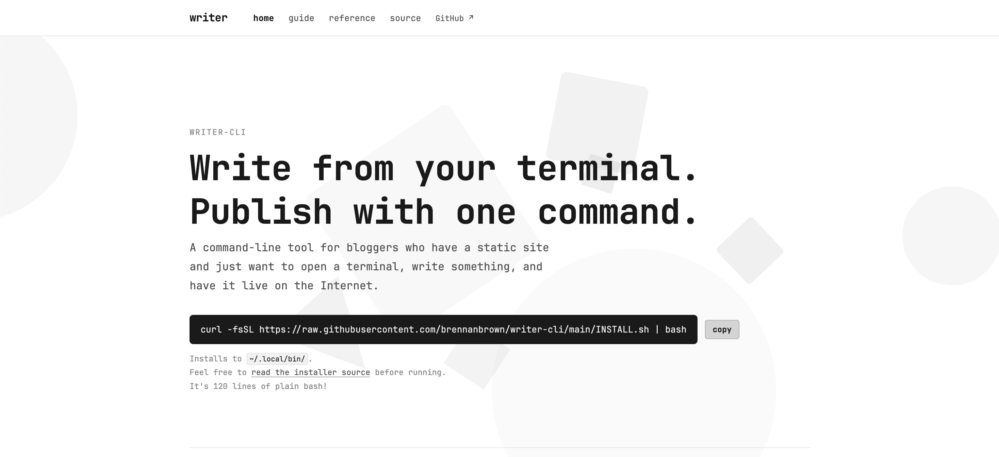

# 🗒️ writer-cli

**Write from your terminal. Publish with one command.**



`writer-cli` is a command-line tool for bloggers who have a static-site generator (SSG) and just want to open a terminal, type a command, write something, and have it published to the Internet.

Visit the [**documentation site**](https://writer.brennanbrown.com) for more information, or read my [write-up blog post](https://brennan.day/introducing-writer-cli-a-bash-tool-i-built-from-scratch-to-blog-in-the-terminal/).

```
$ writer my-new-post

Post title (human-readable, e.g. 'My New Post'): My New Post
Tags (comma-separated): life, coffee

→ Created: content/posts/my-new-post/index.md
→ Opening in micro...

[you write your post and save]

Summary / description: A short piece about mornings.
Confirm build and push? [Y/n]:

→ Building site... done (1.8s)
→ git add .
→ git commit -m "new post: my-new-post"
→ git push...

✓ Published: my-new-post
```

## Install in one line

```sh
curl -fsSL https://raw.githubusercontent.com/brennanbrown/writer-cli/main/INSTALL.sh | bash
```

That's it. The installer will:
1. Download `writer` and put it in `~/.local/bin/`
2. Add it to your PATH
3. Walk you through a short setup so it knows where your blog lives

After the installer finishes, reload your shell profile so the new `~/.local/bin/` PATH entry takes effect:

```sh
source ~/.bashrc   # bash
source ~/.zshrc    # zsh
```

> **NOTE:** Now, of course you shouldn't blindly copy-paste commands from the Internet into your terminal, so only do that if you trust me! You can visit that URL and the repo and read everything that goes into the scripts I've made. Again, there's no building or compiling or dependencies, so WYSIWYG!

### Other install methods

**Homebrew** (macOS / Linux):
```sh
brew tap brennanbrown/writer
brew install writer
```

**Basher**:
```sh
basher install brennanbrown/writer-cli
```

## First-time setup

After installing, run:

```sh
writer --setup
```

The wizard asks you questions (each with a sensible default you can accept by pressing Enter). It then saves a config file to `~/.config/writer/config`. You only need to do this once.

If you run `writer` for the first time without running `--setup`, the wizard starts automatically.

## What "the slug" means

When you run `writer my-post-title`, the part after `writer` is called the **slug**. It becomes the URL path for your post, so keep it:

- **all lowercase**: `my-post`, not `My-Post`
- **hyphens instead of spaces**: `on-the-road`, not `on the road`
- **letters, numbers, hyphens only**: no underscores, dots, or special characters

Examples of valid slugs:

```sh
writer on-the-meaning-of-home
writer coffee-and-clarity
writer 2026-reflections
```

## The Full Workflow

```
1.  writer my-slug          ← you type this
2.  Title: ______           ← you type your post title (required)
3.  Tags: _______           ← comma-separated tags, or just press Enter to skip
4.  [micro opens]           ← your editor opens; write your post, then save and close
5.  Summary / description:  ← optional one-line description, or press Enter to skip
6.  Confirm build? [Y/n]:   ← press Enter (or Y) to publish, N to save without publishing
7.  ✓ Published             ← done
```

At step 6, if you press **N**, your post file is saved but nothing is built or pushed. You can come back and publish later.

## Saving a draft

```sh
writer my-post --draft
```

This sets `draft: true` in your post's frontmatter, so Hugo won't include it in the public build. Useful for work-in-progress posts.

## Writing without publishing immediately

```sh
writer my-post --no-push    # build the site, but don't git push
writer my-post --no-build   # skip the build entirely, just commit and push the file
```

## Using `writer` over SSH

A great way to use `writer` is on a remote server: you SSH in, write, disconnect, and the post is live. No local installs needed.

```sh
ssh you@yourserver.com
writer my-post
```

Set `SITE_DIR` in your config (via `writer --setup`) to point to your Hugo project directory on the server. `writer` will `cd` there automatically before doing anything.

For even faster access from your laptop, add an alias:

```sh
# In your ~/.bashrc or ~/.zshrc
alias blog='ssh you@yourserver.com'
```

Then `blog` drops you straight into the server.

If your connection is unreliable (mobile, etc.), run `writer` inside `tmux` so a dropped connection doesn't interrupt a write:

```sh
tmux new-session -A -s write
writer my-post
```

If you get disconnected, `tmux attach` on reconnect puts you back where you were.

## Re-running setup / changing settings

```sh
writer --setup
```

Every setting is shown with its current value. Press Enter to keep it, or type a new value. Your config is saved when you finish.

## Supported editors

The default editor is [`micro`](https://micro-editor.github.io), a small terminal editor that works like a GUI text editor (Ctrl+S to save, Ctrl+Q to quit, no modes). It is recommended for new users.

You can change the editor in `--setup` or by setting `EDITOR=` in `~/.config/writer/config`. Any terminal editor works: `nano`, `vim`, `nvim`, `hx`, etc.

## Project-local settings (`.writerrc`)

If you have multiple blogs or want different settings per project, create a `.writerrc` file in the root of your SSG blogging site. Settings here override your global config.

```ini
# .writerrc: overrides ~/.config/writer/config for this project only
DEFAULT_SECTION=notes
FRONTMATTER_FORMAT=toml
```

## All flags

| Flag | What it does |
|---|---|
| `--draft` | Saves post as a draft (`draft: true`) |
| `--no-push` | Builds the site but skips `git push` |
| `--no-build` | Skips the build; only commits and pushes the file |
| `--toml` | Uses TOML frontmatter (`+++`) instead of YAML (`---`) |
| `--dry-run` | Shows you what the frontmatter would look like (writes nothing) |
| `--section <name>` | Puts the post in a different content section (e.g. `notes`, `essays`) |
| `--ssg <name>` | Overrides the SSG for this run (`hugo`, `eleventy`, `jekyll`) |
| `--setup` | Runs the setup wizard |
| `-h`, `--help` | Shows help |

## All config keys

These live in `~/.config/writer/config` (set via `writer --setup`):

| Key | Default | What it does |
|---|---|---|
| `SSG` | `hugo` | Which static site generator you use |
| `BUILD_CMD` | `hugo --minify` | The exact command to build your site |
| `CONTENT_DIR` | `content` | Folder where posts live, relative to site root |
| `DEFAULT_SECTION` | `posts` | Sub-folder inside `CONTENT_DIR` for new posts |
| `BUNDLE_FORMAT` | `true` | `true` = `slug/index.md`; `false` = `slug.md` |
| `FRONTMATTER_FORMAT` | `yaml` | `yaml` or `toml` |
| `EDITOR` | `micro` | Terminal editor binary |
| `GIT_COMMIT_MSG` | `new post: {slug}` | Commit message template; `{slug}` is replaced with the actual slug |
| `TIMEZONE` | `auto` | `auto` uses system timezone, or set an IANA name like `America/Winnipeg` |
| `SITE_DIR` | *(blank)* | Absolute path to your site root, useful when running writer from elsewhere |

## Dependencies

Everything `writer` needs must be installed on the machine where it runs (your computer or your server):

| Tool | How to get it |
|---|---|
| `bash` | Already on Mac and Linux |
| `git` | `sudo apt install git` / already on Mac |
| `micro` | `curl https://getmic.ro \| bash` → move to `~/.local/bin/` |
| Hugo | [gohugo.io/installation](https://gohugo.io/installation/) |

`writer` itself has no other dependencies, it is plain shell script.

## Exit codes

| Code | Meaning |
|---|---|
| `0` | Success |
| `1` | Bad slug, missing argument, missing dependency, or empty title |
| `2` | File already exists and you chose not to overwrite it |
| `3` | Build command failed |
| `4` | Git step failed |
| `5` | Config file has an unknown or invalid setting |

## About & Support

Hi, I'm Brennan! I'm a Queer Métis author and FOSS web developer based in Mohkínstsis, Treaty 7 territory. I'm the founder of [🍓 Berry House](https://berryhouse.ca). I write personal essays, cultural criticism, and about why the Internet is worth fighting for. IndieWeb forever!

I built `writer-cli` inspired by the [TTBP (tilde.town feels engine)](https://github.com/modgethanc/ttbp), a blogging tool from the tildeverse that makes writing and publishing feel effortless. I wanted something like that for my own static site. If it's useful to you too, I'd love it if you considered supporting my work:

👉 **[brennan.day/support](https://brennan.day/support)**

## Project layout

```
writer.sh             ← main script
lib/
  defaults.sh         ← global variables and colour helpers
  config.sh           ← config file parsing
  args.sh             ← flag parsing and --help
  setup.sh            ← --setup wizard
  validate.sh         ← slug validation and date formatting
  frontmatter.sh      ← YAML/TOML frontmatter builders
  deps.sh             ← dependency pre-flight checks
  post.sh             ← main post-creation workflow
config.example        ← annotated example config file
tests/
  test_writer.sh      ← 100+ assertion test suite
site/                 ← Eleventy documentation site
INSTALL.sh            ← one-command installer
CHANGELOG.md          ← version history
CONTRIBUTING.md       ← dev setup, style rules, PR guidelines
```
---

**License:** AGPL-3.0 · **Author:** [Brennan Kenneth Brown](https://brennan.day) · A [🍓 Berry House](https://berryhouse.ca) Project